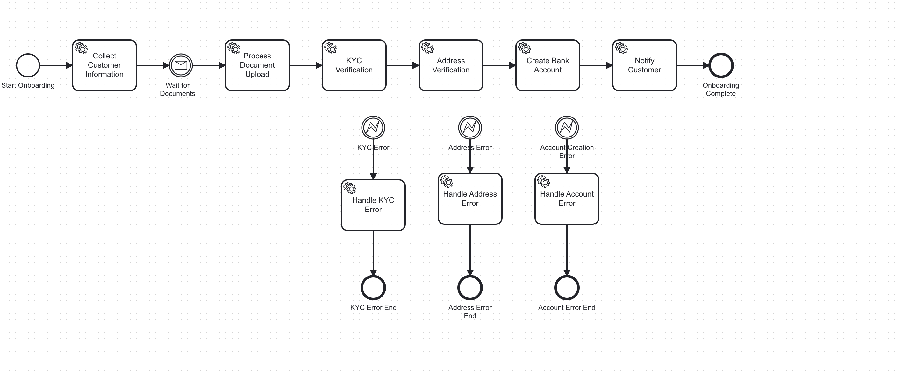

# Bank ABC Digital Customer Onboarding

A Spring Boot microservice for multi-step digital customer onboarding with Camunda BPMN workflow orchestration.

## Table of Contents

- [Overview](#overview)
- [Features](#features)
- [Architecture](#architecture)
- [Quick Start](#quick-start)
- [Development Setup](#development-setup)
- [Docker Deployment](#docker-deployment)
- [API Documentation](#api-documentation)
- [Configuration](#configuration)
- [Testing](#testing)
- [Troubleshooting](#troubleshooting)
- [Production Deployment](#production-deployment)

## Overview

This microservice enables customers to complete their bank account onboarding process online through a multi-step workflow. The process is orchestrated using Camunda BPMN engine, ensuring reliable and trackable customer onboarding.

## Features

- **Multi-step Onboarding Process**: Collect customer information and upload documents in separate steps
- **BPMN Workflow Orchestration**: Uses Camunda BPMN engine for process management
- **Document Upload**: Support for passport and photo document uploads
- **KYC Verification**: Know Your Customer verification process
- **Address Verification**: Customer address validation
- **Account Creation**: Automatic bank account creation with IBAN
- **Customer Notifications**: Email and SMS notifications
- **Process Tracking**: Real-time status tracking and progress monitoring
- **File Storage**: Local file storage for uploaded documents
- **RESTful API**: Complete REST API with OpenAPI documentation

## Architecture

### Cloud Architecture Overview


### BPMN Workflow

The onboarding process follows this workflow:



**Process Flow:**
1. **Collect Customer Information** → Wait for documents
2. **Upload Documents** → KYC Verification → Address Verification → Account Creation → Notify Customer → End

### Components

- **Controllers**: REST endpoints for workflow operations
- **Services**: Business logic and BPMN process management
- **Delegates**: Camunda BPMN task delegates for each workflow step
- **Entities**: JPA entities for data persistence
- **DTOs**: Data transfer objects for API communication
- **File Storage**: Service for handling document uploads

## Quick Start

### Prerequisites

- **Java 21** 
- **Maven 3.6+**
- **Spring Boot 3.4.3** (Latest stable version)
- Docker & Docker Compose (optional, for containerized deployment)

### Option 1: Run with Maven (Recommended for Development)

```bash
# 1. Clone the repository
git clone <repository-url>
cd bank-abc-onboarding

# 2. Build the project (MANDATORY - generates OpenAPI DTOs)
mvn clean install

# 3. Run the application
mvn spring-boot:run

# 4. Access the application
# - API: http://localhost:8080
# - Swagger UI: http://localhost:8080/swagger-ui.html
# - API Documentation: http://localhost:8080/api-docs
# - Camunda Cockpit: http://localhost:8080/camunda
# - H2 Console: http://localhost:8080/h2-console
```

### Option 2: Run with Docker

```bash
# 1. Clone the repository
git clone <repository-url>
cd bank-abc-onboarding

# 2. Start with Docker Compose
docker-compose up -d

# 3. Wait for startup (20-30 seconds)
curl http://localhost:8080/actuator/health

# 4. Access the application
# - API: http://localhost:8080
# - Swagger UI: http://localhost:8080/swagger-ui.html
# - API Documentation: http://localhost:8080/api-docs
# - Camunda Cockpit: http://localhost:8080/camunda
# - Email Testing UI: http://localhost:8081
```

### Default Credentials

- **Camunda Admin**: admin/admin
- **H2 Database**: sa/password

## Development Setup

### IDE Setup (IntelliJ IDEA)

#### 1. Import Project

1. **Open IntelliJ IDEA**
2. **File** → **Open** (or **Import** → **Existing Maven Project**)
3. **Navigate** to the project folder and select it
4. **Click** "Open" or "OK"
5. **Wait** for IntelliJ to index the project and download dependencies

#### 2. Configure IDE

1. **Enable Annotation Processing**:
   - Go to **File** → **Settings** → **Build, Execution, Deployment** → **Compiler** → **Annotation Processors**
   - Check **"Enable annotation processing"**

2. **Maven Import Settings**:
   - Go to **File** → **Settings** → **Build, Execution, Deployment** → **Build Tools** → **Maven**
   - Ensure **"Import Maven projects automatically"** is checked

3. **Java Version**:
   - Go to **File** → **Project Structure** → **Project**
   - Set **Project SDK** to Java 21
   - Set **Project language level** to 21
   - Ensure **Maven compiler** is set to Java 21

#### 3. Generate DTOs (MANDATORY)

**⚠️ IMPORTANT**: This step is mandatory for generating DTOs from the OpenAPI specification.

```bash
# Run Maven build to generate OpenAPI classes
mvn clean install -DskipTests=true
```

**Why this step is required:**
- The project uses OpenAPI code generation for DTOs and interfaces
- Generated classes are required for compilation and runtime
- Without this step, you'll encounter compilation errors

#### 4. Run the Application

1. **Find the main class**: Look for `OnboardingApplication.java` with `@SpringBootApplication` annotation
2. **Right-click** on the class
3. **Choose** "Run 'OnboardingApplication'" or "Debug 'OnboardingApplication'"
4. **Wait** for the application to start (about 10-15 seconds)

### Alternative IDE Setup

#### Eclipse

1. **Import** as Maven project
2. **Run** `mvn clean install` in terminal
3. **Right-click** project → **Run As** → **Java Application**
4. **Select** `OnboardingApplication` as main class

#### VS Code

1. **Install** Java Extension Pack
2. **Open** project folder
3. **Run** `mvn clean install` in integrated terminal
4. **Use** "Run Java" command or debug configuration

### Project Structure

```
src/
├── main/
│   ├── java/com/bankabc/onboarding/
│   │   ├── controller/          # REST controllers
│   │   ├── delegate/           # Camunda BPMN delegates
│   │   ├── dto/               # Data transfer objects
│   │   ├── entity/            # JPA entities
│   │   ├── service/           # Business services
│   │   └── OnboardingApplication.java
│   └── resources/
│       ├── processes/         # BPMN process definitions
│       ├── openapi.yaml      # OpenAPI specification
│       └── application.yml   # Application configuration
└── test/                     # Test classes
```

## Docker Deployment

### Cross-Platform Compatibility

This application uses `--platform linux/amd64` specification to ensure compatibility across different operating systems:

- ✅ **Windows** (with Docker Desktop)
- ✅ **macOS** (with Docker Desktop) 
- ✅ **Linux** (native and with Docker)

### Docker Configuration

The application uses a multi-stage Docker build:

- **Build Stage**: `eclipse-temurin:21-jdk` for compiling the application
- **Runtime Stage**: `eclipse-temurin:21-jre-jammy` for running the application

#### Why Platform Specification is Required

Java 21 has known compatibility issues with ARM64 architecture in Docker environments, causing `SIGILL` JVM crashes. The `--platform linux/amd64` specification:

- Forces Docker to use x86_64 emulation instead of native ARM64
- Resolves Java 21 compatibility issues on ARM64-based systems (Apple Silicon, ARM servers)
- Ensures consistent behavior across all platforms
- Maintains optimal performance with slight emulation overhead

### Docker Commands

#### Option 1: Docker Compose (Recommended)

```bash
# Build and start all services (application + email server)
docker-compose up -d

# Check status
docker-compose ps

# View logs
docker-compose logs bank-abc-onboarding

# Stop services
docker-compose down
```

#### Option 2: Manual Docker Build

```bash
# Build the Docker image
docker build --platform linux/amd64 -t bank-abc-onboarding .

# Run the container
docker run --rm -p 8080:8080 --name bank-abc-test bank-abc-onboarding

# Test the application
curl http://localhost:8080/actuator/health
```

### Docker Compose Services

The `docker-compose.yml` includes:

- **bank-abc-onboarding**: Main application service
- **smtp4dev**: Email testing server

```yaml
services:
  bank-abc-onboarding:
    build: .
    platform: linux/amd64
    container_name: bank-abc-onboarding
    ports:
      - "8080:8080"
    environment:
      - SPRING_PROFILES_ACTIVE=docker
      - SPRING_DATASOURCE_URL=jdbc:h2:mem:testdb
      - SPRING_MAIL_HOST=smtp4dev
      - SPRING_MAIL_PORT=25
    depends_on:
      - smtp4dev

  smtp4dev:
    image: rnwood/smtp4dev:v3
    container_name: bank-abc-smtp4dev
    ports:
      - "2525:25"   # SMTP server port
      - "8081:80"   # Web UI port
```

## API Documentation

### Swagger UI & OpenAPI

The application provides comprehensive API documentation through Swagger UI and OpenAPI 3.0 specification:

- **Swagger UI**: `http://localhost:8080/swagger-ui.html`
- **OpenAPI JSON**: `http://localhost:8080/api-docs`
- **API Base URL**: `http://localhost:8080/api/v1`

### SpringDoc Configuration

The application uses SpringDoc OpenAPI 2.7.0 with the following configuration:

```yaml
springdoc:
  api-docs:
    resolve-schema-properties: true
    enabled: ${VAR_SWAGGER_UI_ENABLED:true}
    path: /api-docs
    servers:
      - url: ${API_DOC_URL:http://localhost:8080/api/v1}
        description: Bank ABC Onboarding API Server
  swagger-ui:
    path: /swagger-ui.html
    disable-swagger-default-url: true
    url: /api-docs
```

### Core Endpoints

#### Start Onboarding Process
```
POST /api/v1/onboarding/start
```
Initiates the onboarding process with customer information.

#### Upload Documents
```
POST /api/v1/onboarding/{processInstanceId}/documents
```
Uploads passport and photo documents to resume the workflow.

#### Get Process Status
```
GET /api/v1/onboarding/{processInstanceId}/status
```
Retrieves current status and progress of the onboarding process.

#### Health Check
```
GET /api/v1/onboarding/health
```
Simple health check endpoint.

### API Examples

#### 1. Start Onboarding Process

```bash
curl -X POST http://localhost:8080/api/v1/onboarding/start \
  -H "Content-Type: application/json" \
  -d '{
    "firstName": "Emma",
    "lastName": "de Vries",
    "gender": "F",
    "dob": "1990-05-20",
    "phone": "+31612345678",
    "email": "emma.devries@example.com",
    "nationality": "Dutch",
    "street": "Keizersgracht 1",
    "city": "Amsterdam",
    "postalCode": "1015CD",
    "country": "Netherlands",
    "ssn": "123-45-6789"
  }'
```

**Response:**
```json
{
  "processInstanceId": "12345",
  "status": "INFO_COLLECTED",
  "message": "Onboarding process started successfully",
  "createdAt": "2024-01-15T10:30:00Z",
  "nextStep": "document_upload",
  "nextStepDescription": "Please upload your passport and photo documents"
}
```

#### 2. Upload Documents

```bash
curl -X POST http://localhost:8080/api/v1/onboarding/12345/documents \
  -F "passport=@passport.pdf" \
  -F "photo=@photo.jpg"
```

**Response:**
```json
{
  "processInstanceId": "12345",
  "status": "DOCUMENTS_UPLOADED",
  "message": "Documents uploaded successfully",
  "uploadedAt": "2024-01-15T10:35:00Z",
  "nextStep": "kyc_verification",
  "nextStepDescription": "Documents processed, verification in progress",
  "passportUploaded": true,
  "photoUploaded": true
}
```

#### 3. Check Process Status

```bash
curl http://localhost:8080/api/v1/onboarding/12345/status
```

**Response:**
```json
{
  "processInstanceId": "12345",
  "status": "KYC_IN_PROGRESS",
  "message": "KYC verification in progress",
  "createdAt": "2024-01-15T10:30:00Z",
  "updatedAt": "2024-01-15T10:35:00Z",
  "kycVerified": false,
  "addressVerified": false,
  "currentStep": "KYC verification in progress",
  "nextStep": "address_verification"
}
```

### Process Status Flow

1. **INITIATED** → Process started
2. **INFO_COLLECTED** → Customer information collected
3. **WAITING_FOR_DOCUMENTS** → Waiting for document upload
4. **DOCUMENTS_UPLOADED** → Documents uploaded successfully
5. **KYC_IN_PROGRESS** → KYC verification in progress
6. **KYC_COMPLETED** → KYC verification completed
7. **ADDRESS_VERIFICATION_IN_PROGRESS** → Address verification in progress
8. **ADDRESS_VERIFICATION_COMPLETED** → Address verification completed
9. **ACCOUNT_CREATION_IN_PROGRESS** → Creating bank account
10. **ACCOUNT_CREATED** → Bank account created
11. **NOTIFICATION_SENT** → Customer notification sent
12. **COMPLETED** → Onboarding completed successfully
13. **FAILED** → Onboarding failed

## Configuration

### Application Properties

```yaml
# Spring Boot Configuration
spring:
  application:
    name: bank-abc-onboarding
  datasource:
    url: jdbc:h2:mem:onboardingdb
    driver-class-name: org.h2.Driver
    username: sa
    password: password

# SpringDoc OpenAPI Configuration
springdoc:
  api-docs:
    resolve-schema-properties: true
    enabled: true
    path: /api-docs
    servers:
      - url: http://localhost:8080/api/v1
        description: Bank ABC Onboarding API Server
  swagger-ui:
    path: /swagger-ui.html
    disable-swagger-default-url: true
    url: /api-docs

# Camunda BPMN Configuration
camunda:
  bpm:
    admin-user:
      id: admin
      password: admin
    webapp:
      enabled: true
    database:
      schema-update: true

# File Storage Configuration
app:
  file-storage:
    path: /tmp/onboarding-documents
    max-size: 10485760  # 10MB
```

### Supported File Types

- **Passport**: PDF files
- **Photo**: JPEG, PNG files
- **Maximum file size**: 10MB per file

### Email Configuration

The application is pre-configured to use smtp4dev for local development:

```yaml
spring:
  mail:
    host: localhost
    port: 2525
    username: 
    password: 
    properties:
      mail:
        smtp:
          auth: false
          starttls:
            enable: false
    from: noreply@bankabc.local
```

## Testing

### Running Tests

```bash
# Run all tests
mvn test

# Run specific test class
mvn test -Dtest=OnboardingWorkflowControllerTest

# Run with coverage
mvn test jacoco:report
```

### Email Testing with smtp4dev

This application uses smtp4dev for local email testing. smtp4dev is a development SMTP server that captures all outgoing emails and provides a web interface to view them.

#### Setting Up Local Email Server

```bash
# Start smtp4dev for email testing
docker-compose up -d

# Check if it's running
docker-compose ps
```

#### Access Email Interface

- **Web UI**: http://localhost:8081
- **SMTP Server**: localhost:2525

#### Testing Email Functionality

1. **Start smtp4dev**:
   ```bash
   docker-compose up -d
   ```

2. **Run the application**:
   ```bash
   mvn spring-boot:run
   ```

3. **Trigger email sending** by completing onboarding steps that send notifications:
   - Start an onboarding process via API
   - Upload documents to trigger KYC verification
   - Complete the workflow to trigger account creation notifications

4. **View captured emails** at http://localhost:8081

### Production Email Configuration

For production environments, override the mail configuration using environment variables:

```bash
export SPRING_MAIL_HOST=smtp.your-provider.com
export SPRING_MAIL_PORT=587
export SPRING_MAIL_USERNAME=your-username
export SPRING_MAIL_PASSWORD=your-password
export SPRING_MAIL_SMTP_AUTH=true
export SPRING_MAIL_SMTP_STARTTLS_ENABLE=true
export SPRING_MAIL_FROM=noreply@yourdomain.com
```

## Troubleshooting

### Common Issues

#### IDE Issues

1. **Compilation Errors**: Ensure you've run `mvn clean install` first
2. **Missing Dependencies**: Refresh Maven project (right-click on `pom.xml` → **Maven** → **Reload project**)
3. **Java Version Issues**: Verify Java 21 is installed and configured in IDE
4. **Annotation Processing**: Enable annotation processing for MapStruct and Lombok

#### Docker Issues

1. **Port conflicts**: Ensure ports 8080, 2525, and 8081 are available
2. **Platform warnings**: The `--platform` warnings are expected and can be ignored
3. **Slow startup**: First run may take longer due to image downloads

#### Performance Notes

- **x86_64 emulation**: Slight performance overhead on ARM64 systems
- **Memory usage**: Application uses ~512MB RAM in container
- **Startup time**: ~20-30 seconds for full application startup

### Code Generation

**⚠️ IMPORTANT**: This project uses OpenAPI code generation for DTOs and interfaces. The generated classes are required for compilation and runtime.

#### Generate OpenAPI Classes

```bash
# Generate OpenAPI models and interfaces
mvn clean compile

# Or use the full build process
mvn clean install
```

This generates the OpenAPI models and interfaces in the `target/generated-sources/openapi` directory.

#### Why Code Generation is Required

- **API DTOs**: All request/response objects are generated from `openapi.yaml`
- **Service Interfaces**: API client interfaces are auto-generated
- **Type Safety**: Ensures compile-time type checking for API contracts
- **Consistency**: Keeps API models in sync with OpenAPI specification

**Note**: Without running the build process, you will encounter compilation errors due to missing generated classes.

## Production Deployment

### Prerequisites

- Production-ready database (PostgreSQL, MySQL, etc.)
- SMTP server configuration
- Proper security settings
- Monitoring and logging setup

### Configuration

1. **Use specific image tags** instead of `latest`
2. **Configure proper logging** and monitoring
3. **Set up health checks** and restart policies
4. **Use external databases** instead of H2
5. **Configure proper email services** instead of smtp4dev

### Environment Variables

```bash
# Database Configuration
export SPRING_DATASOURCE_URL=jdbc:postgresql://localhost:5432/onboarding
export SPRING_DATASOURCE_USERNAME=your-username
export SPRING_DATASOURCE_PASSWORD=your-password

# Email Configuration
export SPRING_MAIL_HOST=smtp.your-provider.com
export SPRING_MAIL_PORT=587
export SPRING_MAIL_USERNAME=your-username
export SPRING_MAIL_PASSWORD=your-password

# Application Configuration
export SPRING_PROFILES_ACTIVE=production
export APP_FILE_STORAGE_PATH=/app/file-storage
```

### Monitoring and Management

#### Camunda Cockpit

Access the Camunda Cockpit at http://localhost:8080/camunda to:
- Monitor running process instances
- View process definitions
- Manage tasks and jobs
- Analyze process performance

#### Health Endpoints

- **Actuator Health**: `/actuator/health`
- **API Documentation**: `/api-docs`
- **Swagger UI**: `/swagger-ui.html`

### Technology Stack

- **Java 21** - Latest LTS version with modern language features
- **Spring Boot 3.4.3** - Latest stable version with full Java 21 support
- **SpringDoc OpenAPI 2.7.0** - Modern API documentation with Swagger UI
- **Camunda BPM 7.23.0** - Business process management and workflow orchestration
- **H2 Database** - In-memory database for development
- **Maven 3.6+** - Build and dependency management

---

## License

This project is licensed under the MIT License - see the LICENSE file for details.

## Contributing

1. Fork the repository
2. Create a feature branch
3. Make your changes
4. Add tests for your changes
5. Submit a pull request

## Support

For support and questions, please contact the development team or create an issue in the repository.